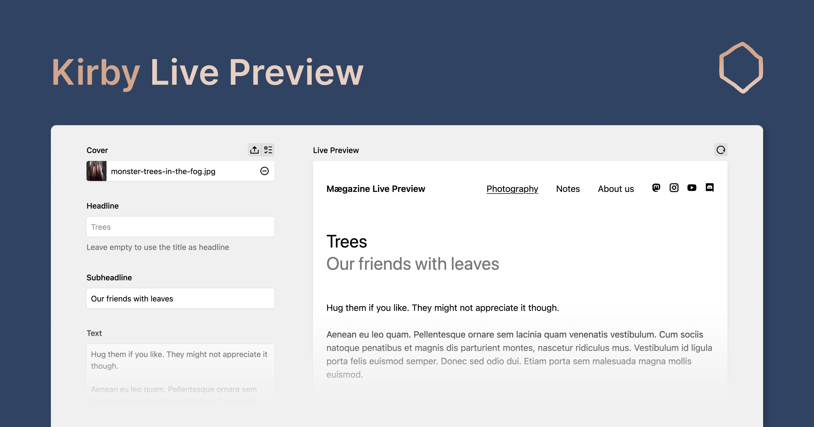

# Kirby Tools

Kirby Tools is a collection of plugins for [Kirby CMS](https://getkirby.com) that primarily focus on enhancing the content editing experience in the Panel.

## Features

> [!TIP]
> Head over to the [website](https://kirby.tools) to learn all about what Kirby Tools has to offer.

---

## Playground

Experience Kirby Tools firsthand in the [interactive playground](https://play.kirby.tools).

## Get Started

To get started, please refer to the [documentation](https://kirby.tools/docs/get-started) for guidance on installation, configuration, and usage.

Here are some quick links:

- [Installation](https://kirby.tools/docs/get-started)
- [Section Configuration](https://kirby.tools/docs/get-started/configuration)

## Support and Questions

We are committed to support you if you have any questions or issues with Kirby Tools. There are several ways to get support:

- **GitHub Discussions**: Join the community and engage in discussions on our [GitHub Discussions page](https://github.com/johannschopplich/kirby.tools/discussions).
- **Email Support**: You can ask questions and seek assistance by emailing us at [hello@kirby.tools](mailto:hello@kirby.tools). Please use the GitHub discussions if you have a general question or comment about Kirby Tools.
- **GitHub Issues**: For reporting bugs or requesting new features, please use the [GitHub Issues page](https://github.com/johannschopplich/kirby.tools/issues).

We encourage you to use the resources above to connect with us and other users of Kirby Tools.

## Feedback

We value your feedback and ideas for improving Kirby Tools. If you have any suggestions, please feel free to reach out to us via email or preferably by creating a new discussion on our [GitHub Discussions page](https://github.com/johannschopplich/kirby.tools/discussions).
